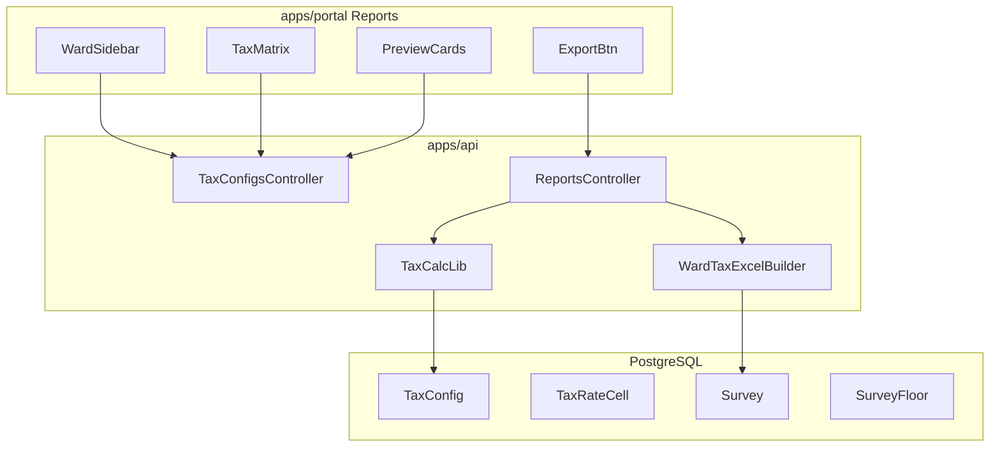

# Chhata Reports: Tax Demand Excel + Unified Tax Rates UI

**Date:** 2026-08-22  
**Status:** Draft — awaiting approval  
**Reference workbook:** `WARD 01 (1).xlsx` (48 columns, sheet `Survey Data`)  
**Reference UI:** SDV EDUTECH Master Data → Tax Rates (screenshots)

## Decisions (from brainstorming)

| Question        | Choice                                                                     |
| --------------- | -------------------------------------------------------------------------- |
| Tax rate source | Port full Tax Config from `sdv-edutech-app` into `sdv-chhata-apps`         |
| UI placement    | **Reports module only** — tax matrix editor + preview + export on one page |

## Problem

1. Current Reports export mirrors **import** layouts (38/55 cols). The required report is **`WARD 01 (1).xlsx`**: 48 cols, **5 header rows**, per-floor **T.Rate / Tax** columns, **Total Tax**.
2. `sdv-chhata-apps` has **no** `TaxConfig`, reference entries, or tax calculation on export.
3. Reports UI is filter cards only — no ward sidebar, rate matrix, live preview, or tax percentages.

## Target Excel contract (`WARD 01 (1).xlsx`)

| Row | Purpose                                                                                         |
| --- | ----------------------------------------------------------------------------------------------- |
| 1   | Ward title banner (merged): Hindi ward name                                                     |
| 2   | Primary column headers (SN, Survey Id, owner/parcel fields, Tax Rate Zone, areas, Total Demand) |
| 3   | Floor group labels (Basement, Ground, First, Second, … Open Land)                               |
| 4   | Residential / Non-Residential under each floor group                                            |
| 5   | Construction bands: RCC / TEEN / KACCHA with **T.Rate** and **Tax** sub-columns                 |
| 6+  | Data rows                                                                                       |

**48 columns** including plot open-land T.Rate/Tax and **Total Tax** (last column).  
Fixture metadata: `fixtures/survey/WARD-01-tax-report-meta.json`.

Tax values must come from **published ward tax config** (road width zone × construction type matrix + property/water/drainage %), not hard-coded.

## Recommended approach

**Port + adapt** (not shared API):

1. **Data layer** — Add Prisma models aligned with edutech: `ReferenceCategory`, `ReferenceEntry`, `TaxConfig`, `TaxRateCell`, `TaxConfigVersion`, `ConfigAuditLog`. Seed Chhata road-width zones, construction types, assessment year `2025-2026`, and default matrix for 15 wards.
2. **Tax math** — Add `packages/tax-calc` (or `apps/api/src/tax/`) porting `computeExportTaxSummary`, `computeFloorAlv`, `roundMoney` from edutech `@workspace/validation`.
3. **Excel builder** — New `ward-tax-report-excel.ts`: renders 5-row header template + data rows from surveys + floors + tax summary. Golden test against `WARD 01 (1).xlsx` row 6 sample.
4. **API** — `tax-configs` module (CRUD, publish, preview) + extend `GET /api/v1/reports/surveys/export` to use tax report builder when `template=ward_tax` (default for Reports).
5. **Portal Reports page** — Unified layout inspired by edutech tax panel:
   - Top: assessment year + export actions
   - Left: ward list + search
   - Right: preview metric cards (zone, annual rate, ALV, property tax)
   - Rate matrix (road × construction)
   - Tax percentages card
   - Export button (authenticated blob download)

**Keep** import-mirror export on `/surveys/export` and imports pipeline (38/55) unchanged — separate from tax demand report.

## Architecture

## Components

### API (`apps/api`)

| Module                             | Responsibility                                                           |
| ---------------------------------- | ------------------------------------------------------------------------ |
| `tax-configs/`                     | Port from edutech: get/update cells, publish, rollback, preview endpoint |
| `reference/` or seed-only          | `TAX_RATE_ZONE`, `CONSTRUCTION_TYPE`, `ASSESSMENT_YEAR` entries          |
| `imports/survey-excel-export.ts`   | Unchanged for import round-trip                                          |
| `reports/ward-tax-report-excel.ts` | **New** WARD 01 layout + tax columns                                     |
| `reports/reports.controller.ts`    | `template`, `assessmentYearId`, stream export                            |

### Portal (`apps/portal/app/(app)/reports/`)

| Component                     | Responsibility                                   |
| ----------------------------- | ------------------------------------------------ |
| `reports-page.tsx`            | Shell: 2-column grid                             |
| `reports-ward-sidebar.tsx`    | Ward search/select, DRAFT/PUBLISHED badge        |
| `reports-tax-matrix.tsx`      | Editable road×construction grid (debounced save) |
| `reports-tax-preview.tsx`     | Selected zone, annual rate, ALV, property tax    |
| `reports-tax-percentages.tsx` | Property / water / drainage %                    |
| `reports-export-toolbar.tsx`  | Filters + download                               |

Reuse `@workspace/ui` (Card, Select, Input, Button), Lucide icons, `cursor-pointer`, focus rings (ui-ux-pro-max municipal palette).

### Permissions

| Permission         | Use                                              |
| ------------------ | ------------------------------------------------ |
| `report:read`      | View reports, preview                            |
| `report:export`    | Download Excel                                   |
| `settings:manage`  | Edit tax matrix (or new `tax:manage` if cleaner) |
| `settings:publish` | Publish ward tax config                          |

## Data flow (export)

1. User selects ward + assessment year on Reports.
2. API loads **published** `TaxConfig` + cells for ward/year.
3. Query surveys (filters: ward, dates, property use) with `floors`.
4. For each survey/floor: resolve zone from `taxRateZone` + construction from floor/building type → lookup `annualRatePerSqFt` → `computeFloorAlv` → sum → water/drainage on assessable ALV → **Total Tax**.
5. Write Excel rows matching fixture column positions; stream response.

## Error handling

- Missing published tax config for ward/year → **409** with message to configure rates on Reports page.
- Missing rate cell for zone×construction → row warning in export job metadata (future); v1: fail export with clear error listing first bad survey id.
- Export row cap: 50,000 (unchanged).

## Testing

- Unit: `tax-calc` (port edutech spec cases).
- Unit: `ward-tax-report-excel` header rows === fixture JSON.
- Integration: export Ward 1 surveys → compare column count, header text, sample row 6 numeric fields to golden fixture.
- API: tax-config CRUD + publish + preview.

## Out of scope (v1)

- District/ULB hierarchy (Chhata single ULB — ward + assessment year only).
- ETL sync from edutech production DB.
- Payment Excel report.
- Embedded survey photos in Excel.

## Success criteria

- Downloaded Reports Excel matches **`WARD 01 (1).xlsx`** structure (5 header rows, 48 cols, Total Tax).
- Changing a rate cell on Reports updates preview and exported tax columns for that ward.
- Import/export 38/55 capture workbooks remain available under Surveys → Import/Export.

## Implementation phases

| Phase | Deliverable                                           |
| ----- | ----------------------------------------------------- |
| 1     | Prisma migration + reference seed + tax-configs API   |
| 2     | `tax-calc` + ward tax Excel builder + export endpoint |
| 3     | Reports unified UI (sidebar, matrix, preview, export) |
| 4     | Golden tests + manual Ward 1 sign-off                 |

---

**Next step after approval:** invoke `writing-plans` skill for implementation plan.
